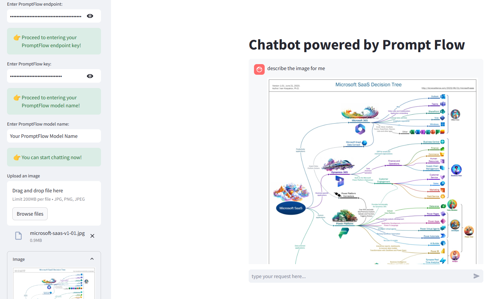
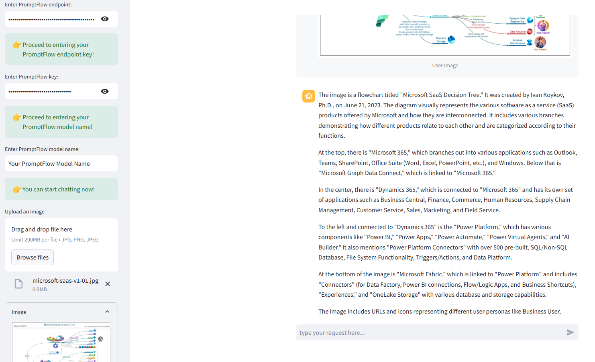
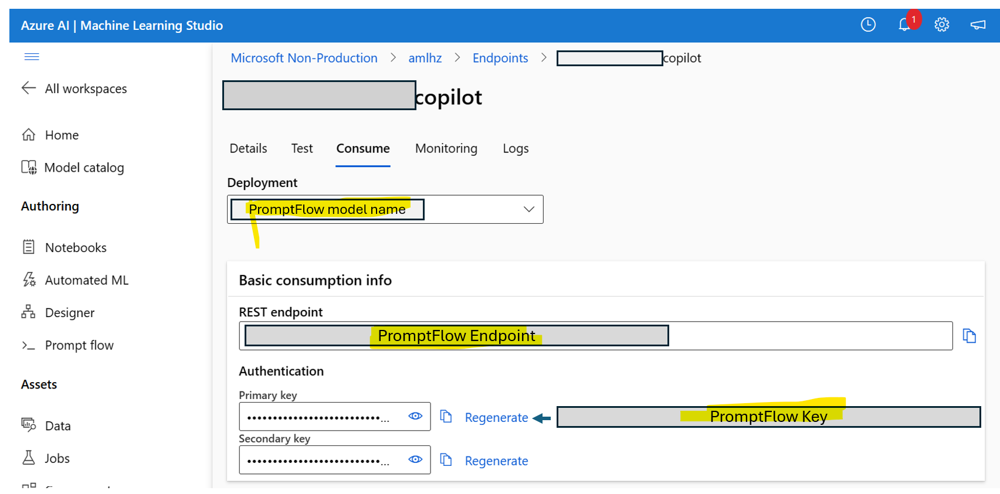

# 🤖💬 PromptFlow Streamlit Chatbot

A conversational chatbot built in Python using Streamlit and any deployed endpoint of Azure PromptFlow.
Refactored from this [solution](https://github.com/dataprofessor/openai-chatbot) 

The application integrates also the multimodal capability of GPT-4-Vision model (as long as wrapped in the PromptFlow) so it can take images as input and does question answering upon it.




## Demo App

[](https://promptflowchatbot.streamlit.app/)

## Prerequisite libraries

```
streamlit
openai
```
## Prerequisite credentials as input to use



## Further Reading

- 🛠️ [Streamlit Documentation Tutorial on _**Build conversational apps**_](https://docs.streamlit.io/knowledge-base/tutorials/build-conversational-apps)
- 📖 [Streamlit Documentation on _**Chat elements**_](https://docs.streamlit.io/library/api-reference/chat)
